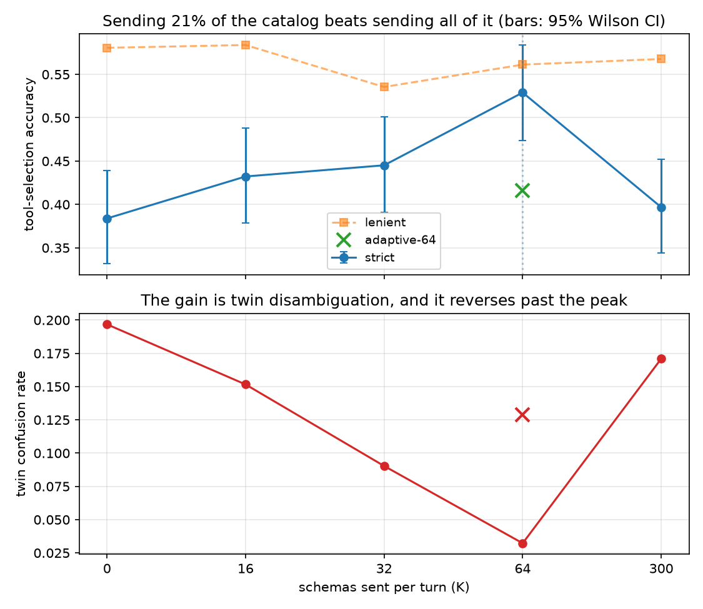
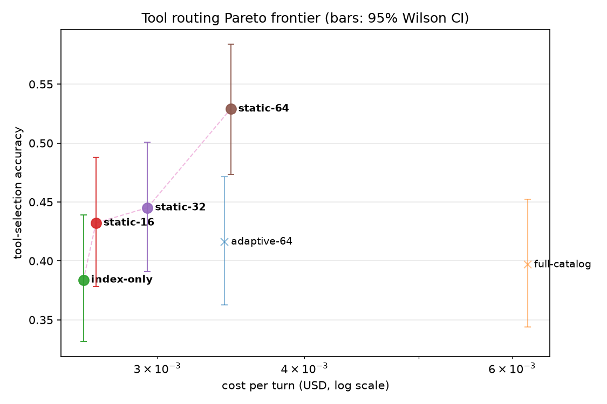

# Findings

Does sending different tool schemas to an MCP agent buy better cost, or better accuracy?
These are the measurements, on a 300-tool catalog against two providers.

## 1. Break-even prices tokens, and tokens are not the binding constraint

Admitting a schema to the cached block costs one prefix rewrite plus the carrying cost of
the extra tokens on every subsequent turn; tail-loading it costs its uncached tokens each
time it is used. Setting those equal gives the number of uses over a horizon `T` at which
admission pays:

```
n* = S·(w − c)/(P·u) + T·c/u          n*/T → c/u  as T → ∞
```

`S` = rewritten segment tokens, `P` = schema tokens, and `u`, `c`, `w` = uncached, cached
and write prices. The asymptotic floor `c/u` is the term that matters: cached tokens still
bill, so no horizon makes a schema free. On Anthropic that floor is a 10% duty cycle; on
Alibaba, 40%.

Measured on live requests, `S` differs by provider in a way that changes the answer by an
order of magnitude:

| provider | honours a second cache breakpoint | S (tokens) | n* at horizon 50 |
|---|---|---|---|
| Anthropic (claude-haiku-4.5) | yes — hot block isolated | 389 | 7.8–9.2 |
| Alibaba (qwen-flash) | no — whole prefix rewrites | 11,641 | 98–142 |

The rule is right about tokens. It asks *"is this schema free?"* and answers correctly.
What it cannot answer is *"is this schema worth paying for?"*, because it has no term for
accuracy at all: `static-hot-set` carries 16 schemas the threshold explicitly rejects and
beats `index-only` by 5.2 points strict on Haiku and 11.8 on qwen. The threshold optimises
`$/turn` when the objective is `$/correct`.

## 2. A correct rule fed a biased estimate looks like the rule failing

Replaying the controller offline against the trace — free, no API calls, admission is a
pure function of the trace — separates "the rule is wrong" from "the estimate is wrong":

| reuse | predictor | admitted | predicted uses | actual | over-forecast | admissions that repaid |
|---|---|---|---|---|---|---|
| 0.0 | LRU-K | 32 | 417.4 | 19 | 22.0x | **0 / 32** |
| 0.0 | oracle | **0** | — | — | — | — |
| 1.0 | LRU-K | 62 | 1322.7 | 70 | 18.9x | 1 / 62 |
| 1.0 | oracle | **22** | 116 | 116 | 1.0x | **22 / 22** |
| 3.0 | oracle | 28 | 178 | 178 | 1.0x | 28 / 28 |

Both failures are present and they are separable. At reuse 0 the oracle admits nothing, so
the *workload* has no profitable admission to find. At reuse 1 the oracle admits 22 and
every one repays, so the rule works — and LRU-K still bought 62 schemas of which 1 repaid.

LRU-K's bias is structural: `span = turn − hits[-k]` is the *shortest* recent window
containing k hits. It conditions on a burst and then extrapolates the burst. A decayed
rate estimator (`predictors.Rate`) cuts the over-forecast from 18.9x to 5x and then admits
nothing at any setting, because the profitable admissions *are* bursts and a burst is not
identifiable until it is over.

Admission also never fires on a one-breakpoint provider even above its own n*: a 620-turn
qwen run at reuse 1.0 (peak/50 = 9) ended with an empty hot set. S = 11,641 is not a
threshold a real trace clears.

## 3. Churn, not caching, is where the money goes

Every membership change rewrites layer B and re-warms everything downstream. Left
unbatched, the hot set changes on **65 of 310 turns** — one turn in five — to hold a set
averaging 2.0 tools.

| epoch | rewrites | tokens written | cost of the rewrites |
|---|---|---|---|
| 1 (unbatched) | 65 | 21,562 | $0.02695 |
| 10 | 22 | 6,318 | $0.00790 |
| 25 | 12 | 2,022 | $0.00253 |
| 50 | 6 | 1,319 | $0.00165 |

Batching admissions into epochs makes N admissions share one rewrite, and costs nothing in
responsiveness that matters: the tail is still recomputed every turn, only membership is
frozen.

## 4. Retrieval amplifies distractors

Layer C tail-loads BM25's top-k for the current query. On a catalog padded with
near-duplicate twins, that is close to the worst available move. Replaying every plan
offline (`scripts/twin_exposure.py`) over the 308 held-out turns whose target has a twin:

| what the prompt shows | share of turns |
|---|---|
| **some** twin's full schema | **98.1%** |
| **the target's own** twin | 25.6% |
| the target's own schema | 38.3% |

The retriever surfaces the target's impostor on 25.6% of turns against the target's own
38.3% — nearly as likely — and it drops some twin's schema into the prompt on
essentially every turn. On a twin-heavy catalog, `tail_k=0` is the correct setting.

## 5. Adaptivity is a liability on stationary traffic

Matched budget, so the only difference is who picks the members. Coverage is the share of
held-out calls whose target sits in the hot set:

| K | static (train frequency) | adaptive (LRU-K) |
|---|---|---|
| 8 | **14.8%** | 10.3% |
| 16 | **27.7%** | 20.3% |
| 32 | **55.2%** | 41.9% |
| 64 | **90.6%** | 75.8% |

The training prior beats LRU-K everywhere. The traffic is stationary, so past frequency
*is* the estimate and adaptivity only adds variance.

## The main experiment

Given all five, the controlled variable is the schema **budget**, and membership is fixed
for the run. `scripts/run_sweep.py frontier` sweeps K from 0 (`index-only`) to 300
(`full-catalog`), with `adaptive-64` at the same budget as `static-64` so any gap between
them is prediction rather than spend.

## Result — haiku-4.5, 300 tools, 310 held-out turns, salt `7a8d59da`

| K | arm | strict | twin | lenient | hit | prompt tok | $/turn | $/correct |
|---|---|---|---|---|---|---|---|---|
| 0 | index-only | 38.4% | 19.7% | 58.1% | 94.7% | 13,657 | **$0.002597** | $0.006765 |
| 16 | static-16 | 43.2% | 15.2% | **58.4%** | 96.4% | 15,954 | $0.002662 | **$0.006158** |
| 32 | static-32 | 44.5% | 9.0% | 53.5% | 96.7% | 18,393 | $0.002943 | $0.006612 |
| 64 | **static-64** | **52.9%** | **3.2%** | 56.1% | 97.3% | 23,314 | $0.003463 | $0.006546 |
| 64 | adaptive-64 | 41.6% | 12.9% | 54.5% | 96.6% | 21,848 | $0.003421 | $0.008222 |
| 300 | full-catalog | 39.7% | 17.1% | 56.8% | 97.6% | 45,681 | $0.006186 | $0.015590 |



Paired McNemar, n=310, minimum detectable gap 4.0%:

| comparison | discordant | p |
|---|---|---|
| static-64 vs index-only | 55/10 | **0.000** |
| static-64 vs full-catalog | 49/8 | **0.000** |
| static-64 vs adaptive-64 | 38/3 | **0.000** |
| static-64 vs static-16 | 45/15 | **0.000** |
| static-32 vs index-only | 28/9 | **0.003** |
| static-16 vs index-only | 27/12 | **0.024** |
| adaptive-64 vs index-only | 22/12 | 0.121 |
| **full-catalog vs index-only** | 21/17 | **0.627** |

### 21% of the catalog beats all of it

`static-64` caches 64 of 300 schemas and beats `full-catalog` by **13.2 points strict**
(49/8, p<0.001) at **56% of the cost** and 2.4x better cost per correct answer. It beats
bare names by **14.5 points** (55/10, p<0.001).

The curve is not monotone. Strict accuracy runs 38.4 → 43.2 → 44.5 → **52.9** → 39.7 as K
goes 0 → 16 → 32 → 64 → 300, peaking at 21% of the catalog and falling off past it. Tool
overload is reproduced here on our own catalog rather than by citation, and the peak is
located.

**Sending every schema is statistically indistinguishable from sending none** (21/17,
p=0.627). The naive default and the cheapest possible arm are the same arm, measured —
which means any tool-selection result compared against `full-catalog` alone is compared
against a baseline that does nothing.

### The gain is entirely twin disambiguation

Lenient accuracy does not move: 58.1 → 58.4 → 53.5 → 56.1 → 56.8, and `static-64` vs
`index-only` is p=0.238. Every one of the 14.5 strict points comes from the twin column,
which traces a clean V: **19.7 → 15.2 → 9.0 → 3.2 → 17.1**.

Layer A already puts the model in the right neighbourhood; names alone reach 58% lenient
and no budget improves on that. What names cannot do is separate a tool from a synthetic
near-duplicate that differs only in its argument schema. So a cached schema is not bought
for cost and not bought for recall — it is bought as *evidence of authenticity*, and that
evidence exists only while the twin lacks one. At K=300 both carry schemas, the signal is
gone, and twin confusion returns to 17.1%.

### Adaptivity costs 11.3 points at matched spend

`adaptive-64` holds the same 64-schema budget, costs the same ($0.003421 vs $0.003463),
and loses to `static-64` 38/3, p<0.001. Against `index-only` it is not significant at all
(22/12, p=0.121): spending 9,585 schema tokens by prediction buys nothing measurable over
spending zero.

### Cost frontier



Under statistical dominance — an arm is dropped only when something cheaper is *not
significantly worse* — the frontier is `index-only`, `static-16`, `static-32`,
`static-64`. `static-32` is on it only after re-admission: it is dominated pairwise by a
cheaper arm, yet beats a frontier member at p=0.003. "Not significantly worse" is not
transitive, so the antichain is not the frontier.

## What to build

The three-layer layout is the contribution. Layer A (names always present) is what makes a
partial schema budget safe, because a tool outside the hot set stays nameable. Layer B is
where the accuracy is, sized by **budget** rather than by threshold. Layer C should be off
on any catalog containing near-duplicates.

To the opening question: schemas buy **accuracy**, not cost. Cost is not the binding
constraint — the spread across the entire frontier is $0.0026 to $0.0062 per turn, while
accuracy spans 38.4% to 52.9%.
